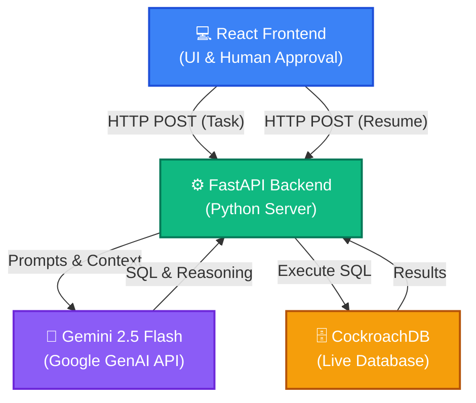
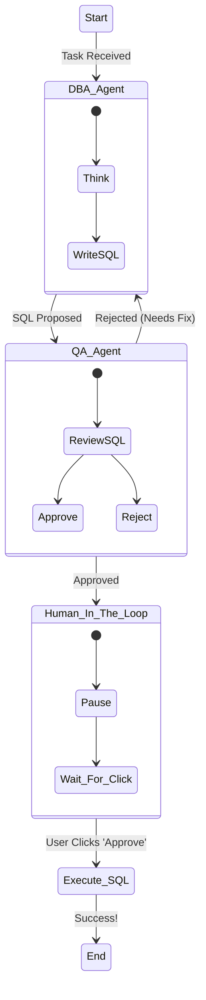

# Autonomous Database Agent (DevOps ADK)

This project is a fully autonomous Database Administrator (DBA) agent built using **LangGraph**, **React**, and **Google GenAI**. It analyzes database schemas, detects issues like write hotspotting in CockroachDB, writes SQL fixes, gets them reviewed by an internal QA Agent, and pauses for human approval before executing them on a live cluster.

## System Architecture

Here is the block diagram of the system. It is broken down into two parts: the overall full-stack architecture, and the internal LangGraph AI Agent flow.

### 1. Full-Stack Architecture

This shows how the different pieces of the system communicate with each other.

---

### 2. Multi-Agent ADK Flow (LangGraph)

This shows the internal state machine running inside our Python backend when a task is received.

